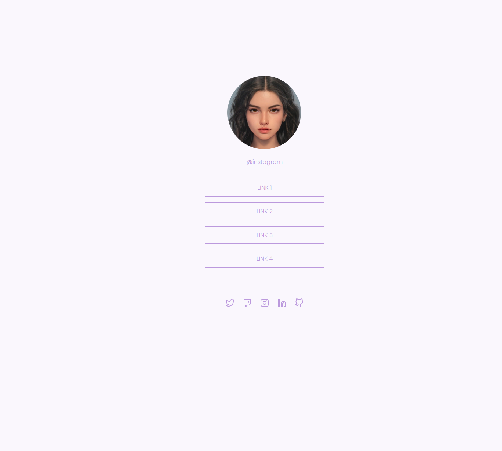
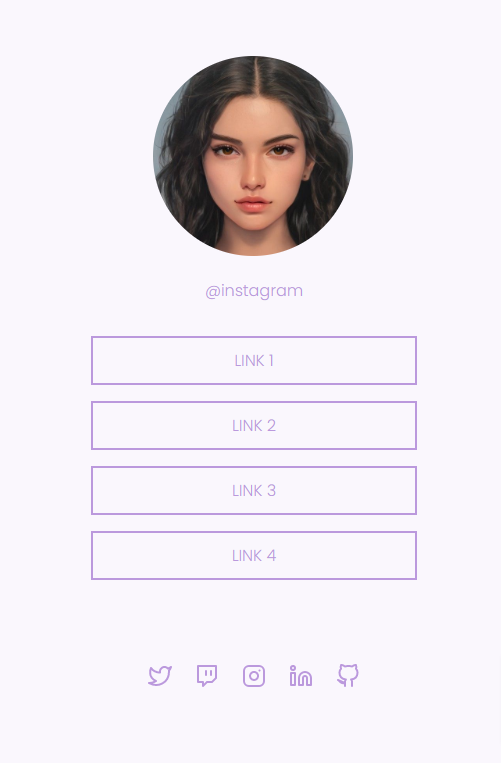

# Social Tree
Projeto criado através da plataforma Rocketseat na trilha Explorer.
## Deploy da aplicação

https://socitree.netlify.app/

## Tecnologias utilizadas

+ HTML5
+ CSS3

## Estrutura do site

+ Foto: Imagem de perfil
+ Links: Região onde se encontra os links
+ Rodapé: Região onde se as redes sociais

## Desktop

## Mobile

